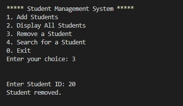
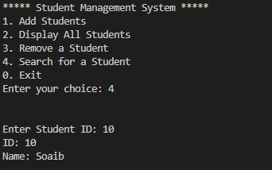
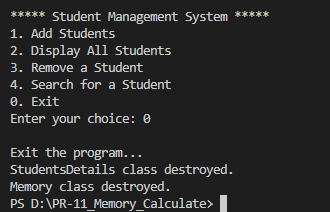

1. Menu Header


2. Add Students


3. Display All Students


4. Remove Student


5. Search Student


6. Exit the Program



Soaib-Shaikh: give me documantation of this code

GitHub Copilot: ### [prog1.cpp](file:///d%3A/PR-11_Memory_Calculate/prog1.cpp)

Below is the documentation for the provided code:

---

#### **Overview**
This program implements a simple **Student Management System** using C++ templates and object-oriented programming principles. It allows users to manage student records, including adding, displaying, removing, and searching for students. The program uses a class hierarchy with a base class `Memory` and a derived class `StudentsDetails`.

---

#### **Classes**

1. **Memory (Template Class)**
   - **Purpose**: Acts as a base class to store student data.
   - **Attributes**:
     - `vector<T> studentIDs`: Stores student IDs.
     - `vector<T> studentNames`: Stores student names.
   - **Methods**:
     - **Constructor**: Displays a message when the class is initialized.
     - **Destructor**: Displays a message when the class is destroyed.

2. **StudentsDetails (Template Class, Derived from Memory)**
   - **Purpose**: Provides functionality to manage student records.
   - **Methods**:
     - **Constructor**: Displays a message when the class is initialized.
     - **addStudents()**: Prompts the user to add multiple students by entering their IDs and names.
     - **displayAllStudents()**: Displays all stored student records.
     - **removeStudent()**: Removes a student record based on the entered student ID.
     - **searchStudent()**: Searches for a student record by ID and displays the details.
     - **Destructor**: Displays a message when the class is destroyed.

---

#### **Main Function**

- **Purpose**: Provides a menu-driven interface for the user to interact with the system.
- **Steps**:
  1. Create an instance of `StudentsDetails<string>` to manage student records with string data types.
  2. Display a menu with the following options:
     - Add Students
     - Display All Students
     - Remove a Student
     - Search for a Student
     - Exit
  3. Execute the corresponding method based on the user's choice.
  4. Repeat until the user chooses to exit.

---

#### **Key Features**

1. **Template Usage**:
   - Both `Memory` and `StudentsDetails` are template classes, allowing flexibility in the data type of student IDs and names.

2. **Dynamic Memory Management**:
   - Uses `std::vector` to dynamically manage student records.

3. **Inheritance**:
   - `StudentsDetails` inherits from `Memory`, reusing its attributes and extending functionality.

4. **Menu-Driven Interface**:
   - Provides an intuitive interface for users to interact with the system.

---

#### **Potential Improvements**
1. **Error Handling**:
   - Improve input validation to handle invalid or unexpected inputs.
   - Avoid displaying "Invalid Choice Id" multiple times in loops.

2. **Efficiency**:
   - Optimize the `removeStudent` and `searchStudent` methods to avoid unnecessary iterations.

3. **Scalability**:
   - Add functionality to save and load student records from a file for persistence.

4. **User Experience**:
   - Enhance the menu display and messages for better clarity.

---

This documentation provides a clear understanding of the program's structure, functionality, and areas for improvement.

Soaib-Shaikh:  please create documantaion of above all code so i can submit in college

GitHub Copilot: ### [prog1.cpp](file:///d%3A/PR-11_Memory_Calculate/prog1.cpp)

Below is the documentation for the provided code, formatted for submission:

---

## **Student Management System**

### **Introduction**
This program implements a **Student Management System** using C++ templates and object-oriented programming principles. It allows users to manage student records, including adding, displaying, removing, and searching for students. The program is designed to be modular and reusable, leveraging inheritance and dynamic memory management.

---

### **Code Structure**

#### **1. Memory Class**
- **Purpose**: Acts as a base class to store student data.
- **Template Parameter**: `T` (data type for student IDs and names).
- **Attributes**:
  - `vector<T> studentIDs`: Stores student IDs.
  - `vector<T> studentNames`: Stores student names.
- **Methods**:
  - **Constructor**: Displays a message when the class is initialized.
  - **Destructor**: Displays a message when the class is destroyed.

#### **2. StudentsDetails Class**
- **Purpose**: Provides functionality to manage student records.
- **Inheritance**: Derived from the `Memory` class.
- **Template Parameter**: Inherits the template parameter `T` from `Memory`.
- **Methods**:
  - **Constructor**: Displays a message when the class is initialized.
  - **addStudents()**:
    - Prompts the user to enter the number of students.
    - Collects student IDs and names and stores them in the `Memory` class vectors.
  - **displayAllStudents()**:
    - Displays all stored student records in a formatted manner.
  - **removeStudent()**:
    - Prompts the user to enter a student ID.
    - Searches for the ID and removes the corresponding student record.
    - Displays a confirmation message or an error if the ID is invalid.
  - **searchStudent()**:
    - Prompts the user to enter a student ID.
    - Searches for the ID and displays the corresponding student details.
    - Displays an error message if the ID is invalid.
  - **Destructor**: Displays a message when the class is destroyed.

#### **3. Main Function**
- **Purpose**: Provides a menu-driven interface for the user to interact with the system.
- **Steps**:
  1. Create an instance of `StudentsDetails<string>` to manage student records with string data types.
  2. Display a menu with the following options:
     - Add Students
     - Display All Students
     - Remove a Student
     - Search for a Student
     - Exit
  3. Execute the corresponding method based on the user's choice.
  4. Repeat until the user chooses to exit.

---

### **Features**

1. **Template-Based Design**:
   - The use of templates allows the program to handle different data types for student IDs and names.

2. **Dynamic Memory Management**:
   - Uses `std::vector` to dynamically manage student records, ensuring efficient memory usage.

3. **Inheritance**:
   - The `StudentsDetails` class inherits from the `Memory` class, reusing its attributes and extending functionality.

4. **Menu-Driven Interface**:
   - Provides an intuitive interface for users to interact with the system.

---

### **How to Use**

1. **Compile the Program**:
   - Use a C++ compiler (e.g., `g++`) to compile the program:
     ```
     g++ prog1.cpp -o StudentManagement
     ```

2. **Run the Program**:
   - Execute the compiled program:
     ```
     ./StudentManagement
     ```

3. **Follow the Menu**:
   - Use the menu options to add, display, remove, or search for students.

---

### **Sample Output**

```
***** Student Management System *****
1. Add Students
2. Display All Students
3. Remove a Student
4. Search for a Student
0. Exit
Enter your choice: 1

Enter the number of students: 2
Enter Student ID: 101
Enter Student Name: Alice
Enter Student ID: 102
Enter Student Name: Bob

***** Student Management System *****
1. Add Students
2. Display All Students
3. Remove a Student
4. Search for a Student
0. Exit
Enter your choice: 2

Student List:
ID: 101
Name: Alice
======================
ID: 102
Name: Bob
======================
```

---

